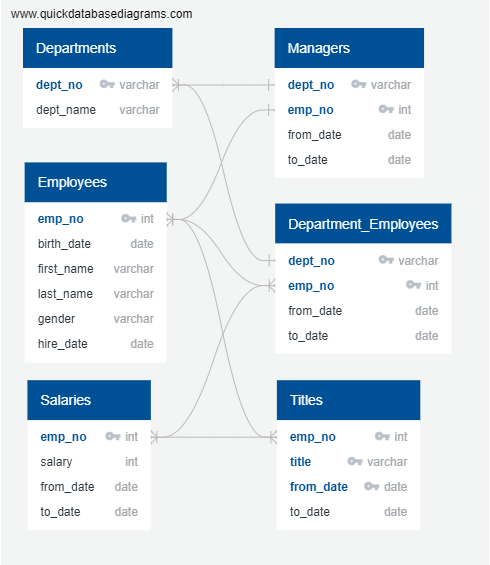
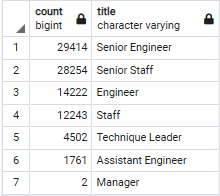

# Pewlett_Hackard_Analysis
## Overview
The retirement landscape is ever changing for employees and employers alike. In some cases, employees decide to take early retirement or continue to work even though they are eligible to retire. It is crucial for employers to identify the needed skillset for their current and future workforce, by effectively monitoring positions affected by employee turnover and retirement. Pewlett Hackard is a large company which is facing thousands of possible job openings, due to the number of expected upcoming retirements. The purpose of this analysis is to determine the number of retiring employees per title and identify employees who are eligible to participate in a mentorship program. An employee database will be built with SQL by applying data modeling, engineering and analysis skills.

### Resources Utilized to Complete Analysis
* **Data Sources:** departments.csv, dept_emp.csv, dept_manager.csv, employees.csv, salaries.csv, titles.csv

* **Entity Relationship Diagram (ERD) Tool:** Quick Database Diagrams

* **Relational Database Management System:** PostgreSQL, pgAdmin

## Pewlett Hackard Employee Database ERD
This ERD highlights the flow of information from one table, or CSV file, to another and captures the primary keys, foreign keys and data types for each column, within the corresponding CSV file.

## Results
* **Total Expected Retirees:** Out of the 300,024 employees at the company, 90,398 (30.13%) employees will likely retire soon.

* **Position Titles for Expected Retirees:** Out of the 90,398 employees likely to retire soon, the majority are Senior Engineers (32.53%) and Senior Staff (31.25%) and the fewest are Managers.

* **Expected Retirees by Department:** Of the employees likely to retire soon, the majority of them work in the Development Department, followed by Production, Sales, Customer Service, Research, Quality Management, Marketing, Human Resources and Finance Departments.

* **Employees Eligible to Participate in Mentorship Program:** A total of 1,549 employees are eligible to participate in Pewlett Hackard’s mentorship program established to promote knowledge transfer and collaboration. The mentor-mentee ratio will on average be 1:59.

## Summary
* **How many roles will need to be filled as the "silver tsunami" begins to make an impact?** It is expected that 90,398 employees will likely retire soon. The number of roles that will need to be filled is dependent on how many employees actually retire.

* **Are there enough qualified, retirement-ready employees in the departments to mentor the next generation of Pewlett Hackard employees?** Although there is a good representation of expected retirees across all departments, there are on average 59 mentees to every 1 mentor. Depending on departmental needs and position type, the mentor-mentee ratio may vary to ensure mentees are gaining the necessary knowledge, skills, experience, information, and advice.

**Possible Queries and Tables Providing Further Insight:**

- **Additional Query:** Expand mentorship eligibility by adjusting the query to capture current employees whose birth dates are outside of the current one-year (January – December 1965) eligibility criteria. Increasing mentorship levels will not only build capacity amongst more employees, but will also allow Pewlett Hackard to experience higher levels of employee engagement and retention.
- **Additional Table:** Employee salaries could be further analyzed, by creating bar charts capturing the average salary by position title.
